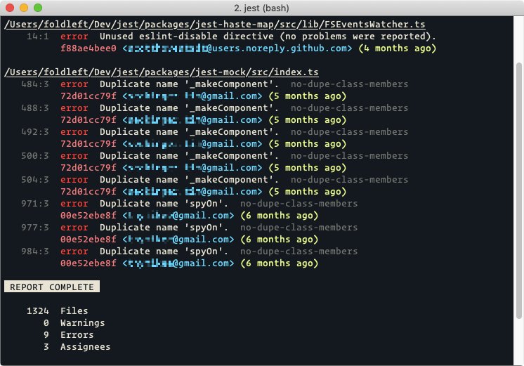
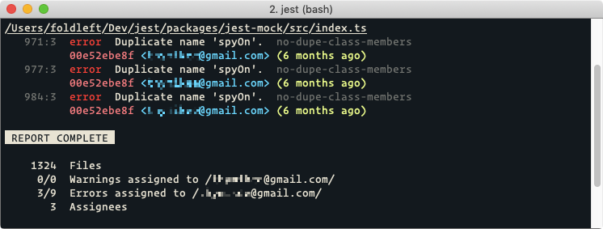

# eslint-formatter-git-log

> ESLint Formatter featuring Git Author, Date, and Hash

[](https://www.npmjs.com/package/eslint-formatter-git-log) [](https://www.npmjs.com/package/eslint-formatter-git-log) [](https://travis-ci.org/JamieMason/eslint-formatter-git-log) [](https://codeclimate.com/github/JamieMason/eslint-formatter-git-log/maintainability)

## Table of Contents

-   [🌩 Installation](#-installation)
-   [🕹 Usage](#-usage)
-   [👀 Examples](#-examples)
-   [⚖️ Configuration](#️-configuration)
-   [🙋🏽‍♂️ Getting Help](#♂️-getting-help)
-   [👀 Other Projects](#-other-projects)
-   [🤓 Author](#-author)

## 🌩 Installation

    npm install --save-dev eslint eslint-formatter-git-log

## 🕹 Usage

To use the default configuration, set ESLint's [`--format`](https://eslint.org/docs/user-guide/command-line-interface#-f---format) option to `git-log` as follows:

    eslint --format git-log './src/**/*.js'

## 👀 Examples

### Full Report

By default, a report of every Error or Warning in the Codebase is displayed:



### Personalised Reports

When an `emailRegExp` is provided such as `/you@yours.com/`, a report is shown that relates only to changes you yourself have made.

1.  Create a file in your project which follows the structure below.

    ```js
    const gitLogFormatter = require("eslint-formatter-git-log");

    module.exports = gitLogFormatter.withConfig({
      emailRegExp: /you@yours.com/
    });
    ```

2.  Set ESLint's [`--format`](https://eslint.org/docs/user-guide/command-line-interface#-f---format) option to your customised version instead of `git-log`:

        eslint --format ./path/to/your/custom-formatter.js './src/**/*.js'



### Contributor Reports

To extend personalised reports to your Team, the Git Committer Email is needed.

#### `gitLogFormatter.getUserEmail()`

An optional helper is available at `gitLogFormatter.getUserEmail()` which reads `git config user.email` and feeds it through `git check-mailmap`.

```js
const gitLogFormatter = require("eslint-formatter-git-log");

module.exports = gitLogFormatter.withConfig({
  emailRegExp: new RegExp(gitLogFormatter.getUserEmail())
});
```

#### `$GIT_COMMITTER_EMAIL`

Alternatively, if your Team each have their `$GIT_COMMITTER_EMAIL` Environment Variable exported and reachable, then the following is enough.

```js
const gitLogFormatter = require("eslint-formatter-git-log");

module.exports = gitLogFormatter.withConfig({
  emailRegExp: new RegExp(process.env.GIT_COMMITTER_EMAIL)
});
```

#### References

-   [First-time git setup](https://git-scm.com/book/en/v2/Getting-Started-First-Time-Git-Setup)
-   [Setting your commit email address](https://help.github.com/en/articles/setting-your-commit-email-address)
-   [Configure git to not guess `user.email`](https://stackoverflow.com/questions/19821895/can-i-configure-git-so-it-does-not-guess-user-email-configuration-settings)
-   [`git config`](https://git-scm.com/docs/git-config)
-   [`git check-mailmap`](https://www.git-scm.com/docs/git-check-mailmap)
-   [`$GIT_COMMITTER_EMAIL`](https://git-scm.com/book/en/v2/Git-Internals-Environment-Variables)

## ⚖️ Configuration

This example lists every available option with its corresponding default value. You don't need to provide a value for every configuration item, just the ones you want to change.

```js
const chalk = require("chalk");
const gitLogFormatter = require("eslint-formatter-git-log");

module.exports = gitLogFormatter.withConfig({
  // If set, only show result when Author Email matches this pattern
  emailRegExp: undefined,
  // Whitespace to insert between items when formatting
  gutter: "  ",
  // Translations for plain text used when formatting
  label: {
    error: "error",
    warning: "warning",
    banner: "REPORT COMPLETE",
    totalFiles: "Files",
    totalAssignees: "Assignees",
    totalWarningsByEmail: `Warnings assigned to %s`,
    totalErrorsByEmail: `Errors assigned to %s`,
    totalWarnings: "Warnings",
    totalErrors: "Errors"
  },
  // Increase if you have files with 1000s of lines
  locationColumnWidth: 8,
  // Which methods of https://github.com/chalk/chalk to use when formatting
  style: {
    // eg. "error"
    error: chalk.red,
    // eg. "/Users/guybrush/Dev/grogrates/src/index.js"
    filePath: chalk.underline,
    // eg. "warning"
    warning: chalk.yellow,
    // eg. "161:12"
    location: chalk.dim,
    // eg. "no-process-exit"
    rule: chalk.dim,
    // eg. "bda304e570"
    commit: chalk.magenta,
    // eg. "(1 year, 2 months ago)"
    date: chalk.greenBright,
    // eg. "<guybrush@threepwood.grog>"
    email: chalk.blueBright
  }
});
```

## 🙋🏽‍♂️ Getting Help

Get help with issues by creating a [Bug Report] or discuss ideas by opening a [Feature Request].

[bug report]: https://github.com/JamieMason/eslint-formatter-git-log/issues/new?template=bug_report.md

[feature request]: https://github.com/JamieMason/eslint-formatter-git-log/issues/new?template=feature_request.md

## 👀 Other Projects

If you find my Open Source projects useful, please share them ❤️

-   [**add-matchers**](https://github.com/JamieMason/add-matchers)<br>Write useful test matchers compatible with Jest and Jasmine.
-   [**eslint-plugin-move-files**](https://github.com/JamieMason/eslint-plugin-move-files)<br>Move and rename files while keeping imports up to date
-   [**eslint-plugin-prefer-arrow-functions**](https://github.com/JamieMason/eslint-plugin-prefer-arrow-functions)<br>Convert functions to arrow functions
-   [**get-time-between**](https://github.com/JamieMason/get-time-between#readme)<br>Measure the amount of time during work hours between two dates
-   [**image-optimisation-tools-comparison**](https://github.com/JamieMason/image-optimisation-tools-comparison)<br>A benchmarking suite for popular image optimisation tools.
-   [**ImageOptim-CLI**](https://github.com/JamieMason/ImageOptim-CLI)<br>Automates ImageOptim, ImageAlpha, and JPEGmini for Mac to make batch optimisation of images part of your automated build process.
-   [**is-office-hours**](https://github.com/JamieMason/is-office-hours#readme)<br>Determine whether a given date is within office hours
-   [**Jasmine-Matchers**](https://github.com/JamieMason/Jasmine-Matchers)<br>Write Beautiful Specs with Custom Matchers
-   [**jest-fail-on-console-reporter**](https://github.com/JamieMason/jest-fail-on-console-reporter#readme)<br>Disallow untested console output produced during tests
-   [**karma-benchmark**](https://github.com/JamieMason/karma-benchmark)<br>Run Benchmark.js over multiple Browsers, with CI compatible output
-   [**karma-jasmine-matchers**](https://github.com/JamieMason/karma-jasmine-matchers)<br>A Karma plugin - Additional matchers for the Jasmine BDD JavaScript testing library.
-   [**logservable**](https://github.com/JamieMason/logservable)<br>git log as an observable stream of JSON objects
-   [**self-help**](https://github.com/JamieMason/self-help#readme)<br>Interactive Q&A Guides for Web and the Command Line
-   [**syncpack**](https://github.com/JamieMason/syncpack#readme)<br>Manage multiple package.json files, such as in Lerna Monorepos and Yarn Workspaces

## 🤓 Author


I'm [Jamie Mason] from [Leeds] in England, I began Web Design and Development in 1999 and have been Contracting and offering Consultancy as Fold Left Ltd since 2012. Who I've worked with includes [Sky Sports], [Sky Bet], [Sky Poker], The [Premier League], [William Hill], [Shell], [Betfair], and Football Clubs including [Leeds United], [Spurs], [West Ham], [Arsenal], and more.

<div align="center">

[![Follow JamieMason on GitHub][github badge]][github]      [![Follow fold_left on Twitter][twitter badge]][twitter]

</div>

<!-- images -->

[github badge]: https://img.shields.io/github/followers/JamieMason.svg?style=social&label=Follow

[twitter badge]: https://img.shields.io/twitter/follow/fold_left.svg?style=social&label=Follow

<!-- links -->

[arsenal]: https://www.arsenal.com

[betfair]: https://www.betfair.com

[github]: https://github.com/JamieMason

[jamie mason]: https://www.linkedin.com/in/jamiemasonleeds

[leeds united]: https://www.leedsunited.com/

[leeds]: https://www.instagram.com/visitleeds

[premier league]: https://www.premierleague.com

[shell]: https://www.shell.com

[sky bet]: https://www.skybet.com

[sky poker]: https://www.skypoker.com

[sky sports]: https://www.skysports.com

[spurs]: https://www.tottenhamhotspur.com

[twitter]: https://twitter.com/fold_left

[west ham]: https://www.whufc.com

[william hill]: https://www.williamhill.com
